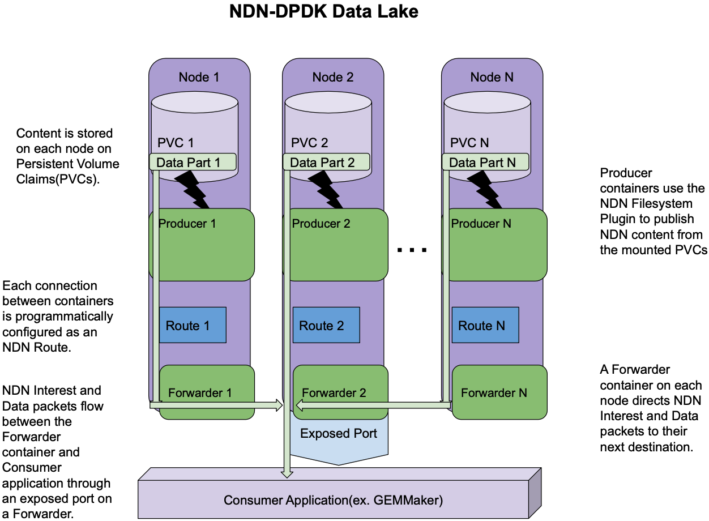

# Genomics Data Lake on GCP
This repository hosts a set of scripts and markup files to setup a genomics data lake on GCP. These scripts were used to setup a Kubernetes cluster on GCP with a multi-node cluster running [NDN-DPDK](https://github.com/usnistgov/ndn-dpdk) forwarder. The demonstration of the built scalable data and compute lake can be found at [https://ndise.net/sc-22](https://ndise.net/sc-22).

# Setup

The setup consists of multiple components deployed as docker containers on GCP VMs. 

1. Data loading and PVCs: Genomics NCBI hosted data was used to populate the data lake. A wrapper around NCBI's prefetch tool to download the hosted genomics data set from [https://github.com/cbmckni/ndn-k8s](https://github.com/cbmckni/ndn-k8s) was used to populate the mounted PVCs (Persistent Volume Claims) on the Kubernetes cluster. 

2. Fileserver and forwarders: Each node on the cluster hosts a NDN-DPDK forwarder and a fileserver deployed as docker containers on the Kubernetes pods.

3. Exposed Kubernetes services via NodePort: A gateway NDN-DPDK forwarder (not shown on the figure for simplicity) is deployed on a separate Kubernetes pod. The gateway forwarder is used to expose the Kubernetes services and contains all registered prefixes for nodes. 